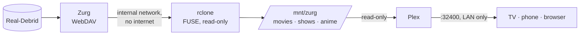

# debrid-plex-stack

Stream your Real-Debrid library in Plex: Real-Debrid → Zurg → rclone → Plex, isolated and LAN-only.

> Designed and written by [Claude](https://claude.ai) (Anthropic) with [007games](https://github.com/007games).

## Install

```bash
curl -fsSL https://raw.githubusercontent.com/007games/debrid-plex-stack/main/install.sh | sudo bash
```

It asks for two things: your [Real-Debrid API token](https://real-debrid.com/apitoken) and a [Plex claim code](https://plex.tv/claim). Then open `http://<server-ip>:32400/web`.

**Needs:** Linux or Synology DSM 7, Docker with Compose v2 (Synology: Container Manager), and Real-Debrid Premium.

**On Synology**, also create the two tasks the installer prints (Control Panel → Task Scheduler). Regular Linux gets systemd units automatically.

## What you get



- **Isolated:** rclone has no internet access and no ports. Zurg listens on `127.0.0.1` only. Plex can't reach either; it only reads the mount.
- **LAN-only:** Remote Access, Relay and UPnP are off, and a firewall rule limits port 32400 to your subnet. No `network_mode: host`.
- **Self-healing:** a watchdog remounts and restarts the stack if the mount dies.
- **Plex pre-configured:** libraries are created. Thumbnails and intro/credit detection are off, because they would read every file from Real-Debrid. Auto-empty-trash is off, so a dropped mount can't wipe your library. Hardware transcoding is used when `/dev/dri` exists (Plex Pass required).

Add content with any Real-Debrid client, e.g. [Debrid Media Manager](https://debridmediamanager.com). It appears in Plex within 15 minutes.

## Commands

```bash
sudo bash /opt/debrid/scripts/status.sh      # health check (Synology: /volume1/@debrid)
sudo bash /opt/debrid/uninstall.sh           # remove (add --purge to delete everything)
curl -fsSL .../install.sh | sudo bash        # re-run to update; keeps your settings
python tools/rd.py status                    # Real-Debrid account helper (RD_TOKEN=...)
```

Options: `DEBRID_DIR=/path`, `PLEX_LANGUAGE=nl-NL`, or `RD_TOKEN=... PLEX_CLAIM=...` for a non-interactive install. Run `install.sh --check` to see what would be detected.

## Notes

- **Turn off UPnP on your router.** The stack doesn't need it, and it lets any device on your network open ports.
- **Plex shows titles as unavailable:** the mount dropped. The watchdog fixes it within ~10 minutes, or run `scripts/boot.sh`.
- **Plex asks for a Plex Pass at home:** run `scripts/plex-setup.sh` again; your device is probably being treated as remote.
- **Stutter on 4K remuxes:** that's the client transcoding. Enable Direct Play in the Plex app, or use lighter releases.

You are responsible for what you stream. Use this only with content you have the right to access, and follow Real-Debrid's terms.

MIT licensed. Created by Claude (Anthropic) for 007games.
